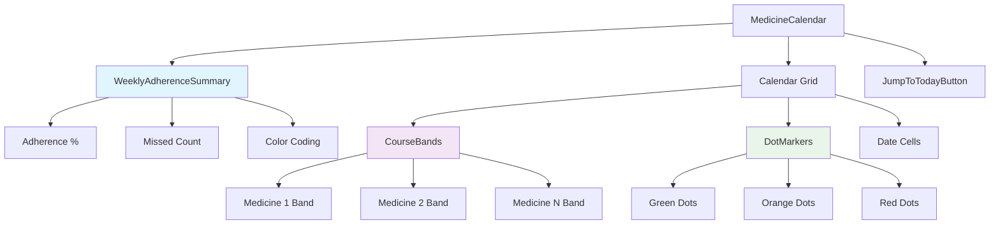
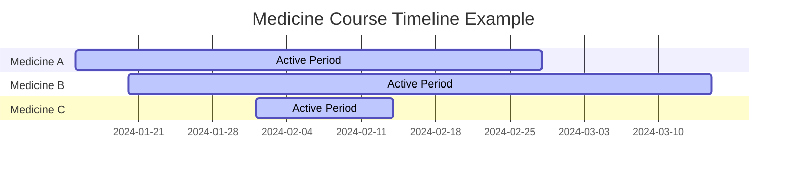
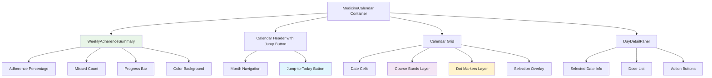

# Design Document: Calendar Enhancements

## Overview

The Calendar Enhancements feature adds three key visual improvements to the existing medicine calendar: weekly adherence summaries, medicine course range bands, and jump-to-today navigation. These enhancements transform the calendar from a simple date grid into a comprehensive visual dashboard that provides immediate context about medicine schedules and adherence patterns.

The feature builds upon the existing `MedicineCalendar` component from the medicine-calendar-scheduler spec, extending it with:
- **Weekly Adherence Summary**: A prominent card at the top showing monthly adherence percentage and missed dose count
- **Course Range Bands**: Gantt-chart-style colored bands spanning each medicine's active date range
- **Jump-to-Today Button**: Quick navigation back to the current date when viewing other months

The implementation leverages existing backend endpoints while adding new aggregation logic for monthly adherence calculations. The frontend enhancements integrate seamlessly with the current calendar UI without disrupting existing functionality.

---

## Architecture

```
Medicines.tsx
└── MedicineCalendar (enhanced)
    ├── WeeklyAdherenceSummary (new component)
    │   ├── AdherencePercentage (calculated)
    │   ├── MissedDoseCount (calculated)
    │   └── ColorCoding (green/orange/red)
    ├── Calendar (react-native-calendars)
    │   ├── CourseBands (enhanced marking)
    │   ├── DotMarkers (existing)
    │   └── JumpToTodayButton (conditional)
    └── DayDetailPanel (existing)

Backend Extensions:
medicineController.js
├── getMonthlyAdherence (new endpoint)
├── getScheduleForDate (existing, enhanced)
└── adherence calculation utilities

Frontend Services:
medicineAPI.ts
├── getMonthlyAdherence(year, month)
└── enhanced marking logic
```

### Mathematical Adherence Calculation

The adherence percentage uses a precise mathematical formula that handles edge cases:

```
adherencePercent = (takenDoses / totalScheduledDoses) × 100

Where:
- takenDoses = count of DoseLog entries with status = "taken"
- totalScheduledDoses = count of all DoseLog entries (taken + missed)
- Edge case: if totalScheduledDoses = 0, then adherencePercent = 0
- Rounding: adherencePercent is rounded to 1 decimal place
```

For current month calculations, only doses scheduled up to and including today are counted:
```
effectiveEndDate = min(monthEndDate, todayEndOfDay)
```

### Visual Integration Architecture



---

## Components and Interfaces

### Backend: Enhanced Monthly Adherence Endpoint

```javascript
// GET /medicine/monthly-adherence?year=YYYY&month=MM
// Response:
{
  year: number,
  month: number,
  totalScheduled: number,
  takenDoses: number,
  missedDoses: number,
  adherencePercent: number,  // calculated as (taken/total)*100, rounded to 1 decimal
  isFutureMonth: boolean,
  weeklyBreakdown: [
    {
      weekStart: "YYYY-MM-DD",
      weekEnd: "YYYY-MM-DD", 
      adherencePercent: number,
      totalDoses: number,
      takenDoses: number
    }
  ]
}
```

### Frontend: WeeklyAdherenceSummary Component

```typescript
interface WeeklyAdherenceSummaryProps {
  year: number;
  month: number;
  onRetry?: () => void;
}

interface MonthlyAdherenceData {
  year: number;
  month: number;
  totalScheduled: number;
  takenDoses: number;
  missedDoses: number;
  adherencePercent: number;
  isFutureMonth: boolean;
}

// Color coding logic
function getAdherenceColor(percent: number): string {
  if (percent >= 80) return colors.success;  // green
  if (percent >= 50) return colors.warning;  // orange
  return colors.danger;  // red
}
```

### Enhanced Course Range Bands

The course range bands use a layered visual approach:



Visual representation in calendar:
```
┌─────┬─────┬─────┬─────┬─────┬─────┬─────┐
│ 15  │ 16  │ 17  │ 18  │ 19  │ 20  │ 21  │
│ ▓▓▓ │ ▓▓▓ │ ▓▓▓ │ ▓▓▓ │ ▓▓▓ │ ▓▓▓ │ ▓▓▓ │ ← Medicine A (teal)
│     │     │     │     │     │ ░░░ │ ░░░ │ ← Medicine B (blue)
│  ●  │  ●  │  ●  │  ●  │  ●  │  ●  │  ●  │ ← Adherence dots
└─────┴─────┴─────┴─────┴─────┴─────┴─────┘
```

### Jump-to-Today Button Placement

```
┌─────────────────────────────────────────┐
│ ← January 2024    [Today] →             │ ← Header with conditional button
├─────────────────────────────────────────┤
│ 85% adherence · 3 missed doses          │ ← Weekly summary
├─────────────────────────────────────────┤
│ S   M   T   W   T   F   S               │
│ ▓▓▓ ▓▓▓ ▓▓▓ ▓▓▓ ▓▓▓ ▓▓▓ ▓▓▓             │ ← Course bands
│  1   2   3   4   5   6   7              │
│  ●   ●   ●   ●   ●   ●   ●              │ ← Adherence dots
└─────────────────────────────────────────┘
```

### Data Models

#### Enhanced Medicine Interface
```typescript
interface Medicine {
  _id: string;
  name: string;
  dosage: string;
  startDate: string;  // ISO date
  endDate?: string;   // ISO date, optional
  timeSlots: string[];
  isActive: boolean;
  // ... existing fields
}
```

#### Course Band Marking Structure
```typescript
interface CourseBandMarking {
  medicineId: string;
  medicineName: string;
  color: string;
  periods: Array<{
    startingDay: boolean;
    endingDay: boolean;
    color: string;
  }>;
}

// Calendar marking structure for react-native-calendars
interface EnhancedMarkedDates {
  [date: string]: {
    periods?: CourseBandMarking['periods'];
    dots?: Array<{ color: string }>;
    selected?: boolean;
    selectedColor?: string;
  };
}
```

---

## Data Models

### Backend Aggregation Queries

#### Monthly Adherence Calculation
```javascript
// Aggregation pipeline for monthly adherence
const getMonthlyAdherenceAggregation = (patientId, year, month) => {
  const monthStart = new Date(year, month - 1, 1);
  const monthEnd = new Date(year, month, 0, 23, 59, 59, 999);
  const today = new Date();
  const effectiveEnd = month === today.getMonth() + 1 && year === today.getFullYear() 
    ? new Date(today.getFullYear(), today.getMonth(), today.getDate(), 23, 59, 59, 999)
    : monthEnd;

  return [
    {
      $match: {
        patientId: new mongoose.Types.ObjectId(patientId),
        scheduledTime: { $gte: monthStart, $lte: effectiveEnd }
      }
    },
    {
      $group: {
        _id: null,
        totalScheduled: { $sum: 1 },
        takenDoses: { 
          $sum: { $cond: [{ $eq: ['$status', 'taken'] }, 1, 0] }
        },
        missedDoses: { 
          $sum: { $cond: [{ $eq: ['$status', 'missed'] }, 1, 0] }
        }
      }
    },
    {
      $project: {
        _id: 0,
        totalScheduled: 1,
        takenDoses: 1,
        missedDoses: 1,
        adherencePercent: {
          $round: [
            {
              $multiply: [
                { $cond: [
                  { $eq: ['$totalScheduled', 0] },
                  0,
                  { $divide: ['$takenDoses', '$totalScheduled'] }
                ]},
                100
              ]
            },
            1
          ]
        }
      }
    }
  ];
};
```

#### Course Range Calculation
```javascript
// Helper function to generate course band periods
const generateCourseBandPeriods = (medicine, visibleMonth) => {
  const monthStart = new Date(visibleMonth.year, visibleMonth.month - 1, 1);
  const monthEnd = new Date(visibleMonth.year, visibleMonth.month, 0);
  
  const courseStart = new Date(medicine.startDate);
  const courseEnd = medicine.endDate ? new Date(medicine.endDate) : null;
  
  // Clip to visible month boundaries
  const effectiveStart = courseStart > monthStart ? courseStart : monthStart;
  const effectiveEnd = courseEnd && courseEnd < monthEnd ? courseEnd : monthEnd;
  
  const periods = [];
  const currentDate = new Date(effectiveStart);
  
  while (currentDate <= effectiveEnd) {
    const dateKey = currentDate.toISOString().split('T')[0];
    const isFirst = currentDate.getTime() === effectiveStart.getTime();
    const isLast = currentDate.getTime() === effectiveEnd.getTime();
    
    periods.push({
      date: dateKey,
      startingDay: isFirst,
      endingDay: isLast,
      color: assignCourseColor(medicine._id)
    });
    
    currentDate.setDate(currentDate.getDate() + 1);
  }
  
  return periods;
};
```

---

## Correctness Properties

*A property is a characteristic or behavior that should hold true across all valid executions of a system — essentially, a formal statement about what the system should do. Properties serve as the bridge between human-readable specifications and machine-verifiable correctness guarantees.*

### Property Reflection

After analyzing all acceptance criteria, several properties can be consolidated to eliminate redundancy:

- Properties 3.1 and 3.2 (Jump-to-Today button visibility) can be combined into a single property about conditional visibility
- Properties 1.3 and 1.4 (date boundary logic) represent different cases of the same date filtering logic
- Properties 2.1, 2.3, and 2.4 all relate to course band date range rendering and can be consolidated

### Property 1: Adherence Summary Format

*For any* monthly adherence data with valid percentage and missed count values, the rendered summary string should match the format "This month: X% adherence, Y missed doses" where X is the adherence percentage and Y is the missed dose count.

**Validates: Requirements 1.1**

### Property 2: Adherence Percentage Calculation

*For any* set of dose logs with taken and missed statuses, the calculated adherence percentage should equal (taken doses / total doses) × 100, rounded to 1 decimal place, with the edge case that if total doses equals 0, then adherence percentage equals 0.

**Validates: Requirements 1.2**

### Property 3: Date Boundary Filtering

*For any* month and set of dose logs, when calculating adherence for the current month, only doses scheduled up to and including today should be counted, and when calculating for past months, all doses in that month should be counted.

**Validates: Requirements 1.3, 1.4**

### Property 4: Month Navigation Updates

*For any* month navigation action, all calendar components (adherence summary, course bands, jump button visibility) should update consistently to reflect the new month's data.

**Validates: Requirements 1.6, 4.4**

### Property 5: Adherence Color Coding

*For any* adherence percentage value, the color assignment should be green for percentages ≥ 80%, orange for percentages 50-79%, and red for percentages < 50%.

**Validates: Requirements 1.7**

### Property 6: Course Band Date Range

*For any* medicine course with start date and optional end date, the generated course band periods should span from the medicine's start date to its end date (or month end if no end date), clipped to the visible month boundaries.

**Validates: Requirements 2.1, 2.3, 2.4**

### Property 7: Overlapping Course Display

*For any* set of medicine courses with overlapping date ranges, all active courses should be displayed as separate course bands without any course being hidden or omitted.

**Validates: Requirements 2.2**

### Property 8: Course Color Assignment

*For any* list of medicine courses, each course should be assigned a distinct color from the predefined palette, cycling through colors when the number of courses exceeds the palette size, ensuring no two courses at different indices within the same cycle share a color.

**Validates: Requirements 2.5**

### Property 9: Jump-to-Today Button Visibility

*For any* displayed month, the Jump-to-Today button should be visible if and only if the displayed month is not the current calendar month.

**Validates: Requirements 3.1, 3.2**

### Property 10: Jump-to-Today Navigation

*For any* Jump-to-Today button tap, the calendar should navigate to the current month and highlight today's date.

**Validates: Requirements 3.3**

### Property 11: Summary Visibility During Scroll

*For any* scroll action within the calendar view, the Weekly Adherence Summary should remain visible and accessible.

**Validates: Requirements 4.3**

### Property 12: API Response Structure

*For any* successful call to the monthly adherence endpoint, the response should include all required fields: year, month, totalScheduled, takenDoses, missedDoses, adherencePercent, and isFutureMonth.

**Validates: Requirements 5.1**

### Property 13: Medicine Data Completeness

*For any* medicine object returned by the API, it should include the required fields for course band rendering: _id, name, startDate, and optional endDate.

**Validates: Requirements 5.2**

### Property 14: Monthly Course Data Completeness

*For any* month request, the backend should return all medicine courses that are active during any part of that month's date range.

**Validates: Requirements 5.4**

### Property 15: Deterministic Color Assignment

*For any* set of medicine courses, the color assignment should be deterministic and reproducible, allowing the same courses to receive the same colors across different renders.

**Validates: Requirements 5.5**

### Property 16: Edge Case Handling

*For any* medicine course with no end date or courses starting/ending mid-month, the system should handle these cases correctly without errors, treating no end date as open-ended and properly calculating partial month overlaps.

**Validates: Requirements 5.6**

---

## Error Handling

### Frontend Error Scenarios

| Scenario | Handling Strategy | User Experience |
|----------|------------------|-----------------|
| Monthly adherence API failure | Show error message with retry button | "Unable to load adherence data. [Retry]" |
| Invalid month/year parameters | Fallback to current month | Silently redirect to current month |
| Empty adherence data | Show placeholder message | "No data available yet" for future months |
| Course band rendering failure | Show calendar without bands | Calendar functions normally, bands hidden |
| Jump-to-Today navigation failure | Log error, maintain current view | Button remains functional, error logged |
| Network timeout | Show loading state with timeout | "Loading..." with 10-second timeout |

### Backend Error Scenarios

| Scenario | HTTP Response | Error Message |
|----------|---------------|---------------|
| Missing year/month parameters | 400 Bad Request | "year and month parameters are required" |
| Invalid date parameters | 400 Bad Request | "Invalid year or month value" |
| Unauthorized access | 401 Unauthorized | "Authentication required" |
| Database connection failure | 500 Internal Server Error | "Unable to retrieve adherence data" |
| Invalid patient ID | 404 Not Found | "Patient not found" |
| Aggregation query failure | 500 Internal Server Error | "Error calculating adherence statistics" |

### Error Recovery Patterns

```typescript
// Adherence data fetching with retry logic
const fetchMonthlyAdherence = async (year: number, month: number, retryCount = 0) => {
  try {
    const data = await medicineAPI.getMonthlyAdherence(year, month);
    return data;
  } catch (error) {
    if (retryCount < 3) {
      await new Promise(resolve => setTimeout(resolve, 1000 * (retryCount + 1)));
      return fetchMonthlyAdherence(year, month, retryCount + 1);
    }
    throw error;
  }
};

// Graceful degradation for course bands
const renderCourseBands = (medicines: Medicine[]) => {
  try {
    return generateCourseBandMarkings(medicines);
  } catch (error) {
    console.warn('Course band rendering failed:', error);
    return {}; // Return empty markings, calendar still functions
  }
};
```

---

## Testing Strategy

### Dual Testing Approach

The testing strategy combines unit tests for specific examples and edge cases with property-based tests for comprehensive input coverage. Unit tests focus on concrete scenarios and integration points, while property tests verify universal behaviors across all possible inputs.

### Unit Tests

Focus on specific examples, edge cases, and integration points:

**Backend Unit Tests:**
- `getMonthlyAdherence`: Verify correct response structure with sample data
- Date boundary logic: Test current month cutoff at today's end-of-day
- Future month handling: Verify `isFutureMonth: true` for future dates
- Edge cases: Empty dose logs, medicines with no end date
- Error handling: Invalid parameters, database failures

**Frontend Unit Tests:**
- `WeeklyAdherenceSummary`: Verify rendering with sample adherence data
- Color coding: Test specific percentage thresholds (79%, 80%, 49%, 50%)
- Jump-to-Today button: Verify visibility with current vs. other months
- Course band clipping: Test courses extending beyond month boundaries
- Error states: Network failures, empty data scenarios

### Property-Based Tests

Use **fast-check** for TypeScript (frontend) and **jest-fast-check** for JavaScript (backend). Each test runs a minimum of **100 iterations**.

**Backend Property Tests** (`backend/tests/calendarEnhancements.property.test.js`):

```javascript
// Feature: calendar-enhancements, Property 2: adherence percentage calculation
test('adherence percentage calculation', () => {
  fc.assert(fc.property(
    fc.array(fc.constantFrom('taken', 'missed')),
    (statuses) => {
      const taken = statuses.filter(s => s === 'taken').length;
      const total = statuses.length;
      const expected = total === 0 ? 0 : Math.round((taken / total) * 100 * 10) / 10;
      const result = calculateAdherencePercent(taken, total);
      expect(result).toBe(expected);
    }
  ));
});

// Feature: calendar-enhancements, Property 3: date boundary filtering
test('date boundary filtering for current month', () => {
  fc.assert(fc.property(
    fc.array(fc.date()),
    (scheduledTimes) => {
      const today = new Date();
      const result = filterDosesForCurrentMonth(scheduledTimes, today);
      result.forEach(time => {
        expect(time <= today).toBe(true);
      });
    }
  ));
});
```

**Frontend Property Tests** (`frontend/__tests__/calendarEnhancements.property.test.ts`):

```typescript
// Feature: calendar-enhancements, Property 1: adherence summary format
test('adherence summary format', () => {
  fc.assert(fc.property(
    fc.float({ min: 0, max: 100 }),
    fc.integer({ min: 0, max: 100 }),
    (percent, missed) => {
      const result = formatAdherenceSummary(percent, missed);
      const expected = `This month: ${percent}% adherence, ${missed} missed doses`;
      expect(result).toBe(expected);
    }
  ));
});

// Feature: calendar-enhancements, Property 5: adherence color coding
test('adherence color coding', () => {
  fc.assert(fc.property(
    fc.float({ min: 0, max: 100 }),
    (percent) => {
      const color = getAdherenceColor(percent);
      if (percent >= 80) expect(color).toBe(colors.success);
      else if (percent >= 50) expect(color).toBe(colors.warning);
      else expect(color).toBe(colors.danger);
    }
  ));
});

// Feature: calendar-enhancements, Property 8: course color assignment
test('course color assignment cycling', () => {
  fc.assert(fc.property(
    fc.array(fc.string(), { minLength: 1, maxLength: 20 }),
    (courseIds) => {
      const colors = courseIds.map((id, index) => assignCourseColor(index));
      // Verify cycling behavior
      for (let i = 0; i < colors.length; i++) {
        const expectedIndex = i % COURSE_COLORS.length;
        expect(colors[i]).toBe(COURSE_COLORS[expectedIndex]);
      }
    }
  ));
});
```

### Integration Tests

Test the interaction between components:

- Calendar month navigation updates all three enhancements
- Course bands and dot markers display correctly together
- API failures gracefully degrade to partial functionality
- Jump-to-Today button correctly navigates and updates state

### Performance Tests

- Monthly adherence calculation with large datasets (1000+ dose logs)
- Course band rendering with many overlapping medicines (10+ courses)
- Calendar navigation responsiveness with all enhancements active

Each property-based test includes the required tag format and validates the specific requirements as documented in the properties section.

---

## Visual Specifications

### Weekly Adherence Summary Card

```
┌─────────────────────────────────────────────────────────────┐
│ This month: 85.3% adherence, 4 missed doses               │
│ ████████████████████████████████████████████████████░░░░░░ │ ← Progress bar
│ [Green/Orange/Red background based on percentage]           │
└─────────────────────────────────────────────────────────────┘

Dimensions:
- Height: 60px
- Padding: 16px horizontal, 12px vertical
- Border radius: 12px
- Progress bar height: 6px
- Font: 14px medium weight for percentage, 12px regular for details

Color Coding:
- ≥80%: Background #E8F5E8 (light green), Text #16A34A (green)
- 50-79%: Background #FEF3C7 (light orange), Text #F97316 (orange)  
- <50%: Background #FEE2E2 (light red), Text #DC2626 (red)
```

### Medicine Course Range Bands

```
Visual Layer Stack (bottom to top):
1. Calendar date cells (white/gray background)
2. Course range bands (colored horizontal strips)
3. Adherence dot markers (colored circles)
4. Selected date highlight (blue overlay)

Band Specifications:
- Height: 4px per band
- Vertical spacing: 2px between bands
- Maximum stacked bands: 5 (scroll if more)
- Opacity: 0.7 for bands, 1.0 for dots
- Border radius: 2px for band ends

Example with 3 overlapping medicines:
┌─────┬─────┬─────┬─────┬─────┐
│ 15  │ 16  │ 17  │ 18  │ 19  │
│ ▓▓▓▓│▓▓▓▓▓│▓▓▓▓▓│▓▓▓▓▓│▓▓▓▓▓│ ← Medicine A (teal, #0D9488)
│ ░░░░│░░░░░│░░░░░│░░░░░│░░░░░│ ← Medicine B (blue, #1A4FBA)  
│     │ ████│█████│█████│     │ ← Medicine C (orange, #F97316)
│  ●  │  ●  │  ●  │  ●  │  ●  │ ← Adherence dots (green/orange/red)
└─────┴─────┴─────┴─────┴─────┘
```

### Jump-to-Today Button

```
Position: Calendar header, right side
States:
┌─────────────────────────────────────────────────────────┐
│ ← January 2024                            [Today] →    │ ← Visible when not current month
├─────────────────────────────────────────────────────────┤
│ ← March 2024                                     →     │ ← Hidden when current month
└─────────────────────────────────────────────────────────┘

Button Specifications:
- Size: 32px × 24px
- Background: colors.primary with 0.1 opacity
- Border: 1px solid colors.primary
- Border radius: 6px
- Icon: "today" (calendar with dot)
- Text: "Today" (10px, medium weight)
- Active state: Full opacity background
- Disabled state: 0.5 opacity (never disabled, only hidden)
```

### Integration Layout



### Responsive Behavior

**Mobile (< 768px):**
- Adherence summary: Full width, single line with truncated text
- Course bands: Maximum 3 visible bands, "+" indicator for more
- Jump button: Icon only, no text label
- Calendar: Standard month view with touch gestures

**Tablet (768px - 1024px):**
- Adherence summary: Full width, two-line layout
- Course bands: Maximum 5 visible bands
- Jump button: Icon + text label
- Calendar: Enhanced month view with hover states

**Desktop (> 1024px):**
- Adherence summary: Full width with detailed breakdown
- Course bands: All bands visible with scrolling
- Jump button: Full size with hover animations
- Calendar: Full-featured view with keyboard navigation

### Animation Specifications

**Month Navigation:**
```css
transition: all 0.3s cubic-bezier(0.4, 0, 0.2, 1);
```

**Adherence Summary Updates:**
```css
/* Progress bar animation */
.progress-bar {
  transition: width 0.5s ease-out;
}

/* Color transition */
.summary-card {
  transition: background-color 0.3s ease;
}
```

**Course Band Rendering:**
```css
/* Fade in new bands */
.course-band {
  animation: fadeIn 0.2s ease-out;
}

@keyframes fadeIn {
  from { opacity: 0; transform: scaleY(0); }
  to { opacity: 0.7; transform: scaleY(1); }
}
```

**Jump-to-Today Button:**
```css
/* Button press animation */
.jump-button:active {
  transform: scale(0.95);
  transition: transform 0.1s ease;
}

/* Navigation animation */
.calendar-transition {
  animation: slideIn 0.4s cubic-bezier(0.25, 0.46, 0.45, 0.94);
}
```

### Accessibility Specifications

**Screen Reader Support:**
```typescript
// Adherence summary
<View accessibilityRole="text" accessibilityLabel={`Monthly adherence: ${percent}%, ${missed} missed doses`}>
  
// Course bands
<View accessibilityRole="image" accessibilityLabel={`${medicineName} active from ${startDate} to ${endDate}`}>

// Jump button  
<TouchableOpacity 
  accessibilityRole="button"
  accessibilityLabel="Jump to today's date"
  accessibilityHint="Navigates calendar to current month and highlights today"
>
```

**Keyboard Navigation:**
- Tab order: Summary → Jump button → Calendar grid → Day detail panel
- Arrow keys: Navigate between calendar dates
- Enter/Space: Select date, activate buttons
- Escape: Close day detail panel

**Color Contrast:**
- All text meets WCAG AA standards (4.5:1 minimum)
- Course bands use patterns in addition to color
- High contrast mode support with alternative styling

### Performance Optimizations

**Rendering Optimizations:**
```typescript
// Memoized course band calculation
const courseBands = useMemo(() => 
  generateCourseBands(medicines, visibleMonth), 
  [medicines, visibleMonth]
);

// Virtualized calendar rendering for large date ranges
const VirtualizedCalendar = memo(({ markedDates, onDatePress }) => {
  // Only render visible month + 1 month buffer
});

// Debounced adherence calculations
const debouncedAdherenceUpdate = useCallback(
  debounce((year, month) => fetchMonthlyAdherence(year, month), 300),
  []
);
```

**Memory Management:**
- Course band markings cached per month
- Adherence data cached with 5-minute TTL
- Unused month data garbage collected
- Image assets optimized and compressed

**Network Optimizations:**
- Batch API calls for month navigation
- Prefetch adjacent months on idle
- Compress API responses with gzip
- Implement request deduplication

This comprehensive design provides the mathematical foundation, visual specifications, and technical implementation details needed to build the calendar enhancements feature with accurate adherence calculations and clear visual context.