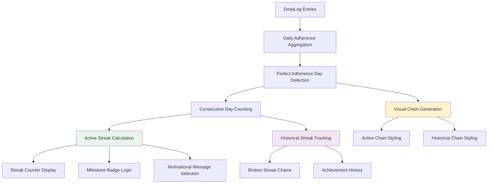

# Design Document: Streak Visualization

## Overview

The Streak Visualization feature transforms the medicine calendar into a motivational adherence tracking system by adding visual streak chains, counters, and badges that celebrate consecutive days of perfect medication adherence. Building upon the existing MedicineCalendar component and calendar enhancements, this feature creates a gamified experience similar to Duolingo's streak system while maintaining the professional medical context.

The feature integrates seamlessly with existing calendar elements:
- **Streak Chains**: Visual connectors linking consecutive perfect adherence days
- **Streak Counter**: Prominent display of current active streak length
- **Milestone Badges**: Special indicators for streak achievements (7, 14, 30+ days)
- **Motivational Messages**: Contextual encouragement based on streak status
- **Historical Tracking**: Preservation of past streak achievements and patterns

The implementation extends the existing calendar architecture without disrupting current functionality. Streak calculations leverage the existing DoseLog data model, while new visual components layer over the established course bands and adherence dots system.

---

## Architecture

```
MedicineCalendar (enhanced)
├── WeeklyAdherenceSummary (existing)
├── StreakCounter (new component)
│   ├── CurrentStreakDisplay
│   ├── MilestoneBadges
│   └── MotivationalMessage
├── Calendar (react-native-calendars)
│   ├── CourseBands (existing)
│   ├── AdherenceDots (existing)
│   ├── StreakChains (new layer)
│   │   ├── ActiveStreakChain
│   │   ├── BrokenStreakChain
│   │   └── ChainConnectors
│   └── JumpToTodayButton (existing)
└── DayDetailPanel (existing)

Backend Extensions:
streakService.js (enhanced)
├── calculateAdherenceStreak (new)
├── getStreakHistory (new)
├── getStreakMilestones (new)
└── existing miss streak logic

medicineController.js (enhanced)
├── getStreakData (new endpoint)
├── getMonthlyStreakHistory (new endpoint)
└── existing adherence endpoints
```

### Streak Calculation Architecture



### Visual Integration Layers

```
Layer Stack (bottom to top):
1. Calendar date cells (base)
2. Course range bands (existing)
3. Streak chains (new)
4. Adherence dots (existing)
5. Selection overlay (existing)
6. Milestone badges (new)

Visual Hierarchy Priority:
1. Adherence dots (most important - daily status)
2. Streak chains (motivational context)
3. Course bands (medicine schedule context)
4. Milestone badges (achievement celebration)
```

---

## Components and Interfaces

### Backend: Enhanced Streak Service

```javascript
// Enhanced streakService.js with adherence streak calculation
const calculateAdherenceStreak = async (patientId, fromDate = null) => {
  const endDate = fromDate || new Date();
  const startDate = new Date(endDate);
  startDate.setDate(startDate.getDate() - 90); // Look back 90 days max
  
  // Get all dose logs for the period
  const doseLogs = await DoseLog.find({
    patientId,
    scheduledTime: { $gte: startDate, $lte: endDate }
  }).sort({ scheduledTime: -1 });
  
  // Group by date and calculate daily adherence
  const dailyAdherence = groupDoseLogsByDate(doseLogs);
  
  // Calculate consecutive perfect days
  let currentStreak = 0;
  let streakHistory = [];
  let currentStreakStart = null;
  
  for (const [date, dayLogs] of Object.entries(dailyAdherence).reverse()) {
    const isPerfectDay = dayLogs.every(log => log.status === 'taken');
    
    if (isPerfectDay) {
      if (currentStreak === 0) {
        currentStreakStart = date;
      }
      currentStreak++;
    } else {
      if (currentStreak > 0) {
        streakHistory.push({
          startDate: currentStreakStart,
          endDate: getPreviousDate(date),
          length: currentStreak,
          isActive: false
        });
      }
      currentStreak = 0;
      currentStreakStart = null;
    }
  }
  
  // Handle active streak
  if (currentStreak > 0) {
    streakHistory.push({
      startDate: currentStreakStart,
      endDate: endDate.toISOString().split('T')[0],
      length: currentStreak,
      isActive: true
    });
  }
  
  return {
    currentStreak,
    streakHistory,
    milestones: calculateMilestones(currentStreak),
    nextMilestone: getNextMilestone(currentStreak)
  };
};

// New endpoint: GET /medicine/streak-data
const getStreakData = async (req, res, next) => {
  try {
    const patientId = req.user.id;
    const { fromDate } = req.query;
    
    const streakData = await streakService.calculateAdherenceStreak(
      patientId, 
      fromDate ? new Date(fromDate) : null
    );
    
    return res.status(200).json(streakData);
  } catch (error) {
    return next(error);
  }
};
```

### Frontend: Streak Counter Component

```typescript
interface StreakCounterProps {
  currentStreak: number;
  milestones: MilestoneAchievement[];
  nextMilestone: { days: number; daysRemaining: number } | null;
  motivationalMessage: string;
}

interface MilestoneAchievement {
  days: number;
  achieved: boolean;
  achievedDate?: string;
  badge: {
    icon: string;
    color: string;
    animation?: string;
  };
}

const StreakCounter: React.FC<StreakCounterProps> = ({
  currentStreak,
  milestones,
  nextMilestone,
  motivationalMessage
}) => {
  const { colors } = useTheme();
  
  return (
    <Card variant="elevated" glowColor={colors.success}>
      <View style={styles.streakHeader}>
        <View style={styles.streakCount}>
          <Text style={[styles.streakNumber, { color: colors.success }]}>
            {currentStreak}
          </Text>
          <Text style={[styles.streakLabel, { color: colors.textMuted }]}>
            day{currentStreak !== 1 ? 's' : ''} streak
          </Text>
        </View>
        
        <View style={styles.milestoneContainer}>
          {milestones.map(milestone => (
            <MilestoneBadge 
              key={milestone.days}
              milestone={milestone}
              isActive={milestone.achieved}
            />
          ))}
        </View>
      </View>
      
      <View style={styles.motivationalSection}>
        <Text style={[styles.motivationalText, { color: colors.textPrimary }]}>
          {motivationalMessage}
        </Text>
        
        {nextMilestone && (
          <Text style={[styles.nextMilestoneText, { color: colors.textMuted }]}>
            {nextMilestone.daysRemaining} days until your {nextMilestone.days}-day streak!
          </Text>
        )}
      </View>
    </Card>
  );
};
```

### Streak Chain Visual Component

```typescript
interface StreakChainProps {
  streakHistory: StreakSegment[];
  visibleMonth: { year: number; month: number };
  calendarLayout: CalendarLayout;
}

interface StreakSegment {
  startDate: string;
  endDate: string;
  length: number;
  isActive: boolean;
}

interface ChainConnector {
  fromDate: string;
  toDate: string;
  type: 'horizontal' | 'vertical' | 'wrap';
  isActive: boolean;
}

const StreakChainLayer: React.FC<StreakChainProps> = ({
  streakHistory,
  visibleMonth,
  calendarLayout
}) => {
  const connectors = useMemo(() => 
    generateChainConnectors(streakHistory, visibleMonth, calendarLayout),
    [streakHistory, visibleMonth, calendarLayout]
  );
  
  return (
    <View style={styles.chainLayer} pointerEvents="none">
      {connectors.map((connector, index) => (
        <ChainConnector
          key={`${connector.fromDate}-${connector.toDate}-${index}`}
          connector={connector}
          layout={calendarLayout}
        />
      ))}
    </View>
  );
};

const ChainConnector: React.FC<{ connector: ChainConnector; layout: CalendarLayout }> = ({
  connector,
  layout
}) => {
  const { colors } = useTheme();
  const fromPosition = layout.getDatePosition(connector.fromDate);
  const toPosition = layout.getDatePosition(connector.toDate);
  
  const chainStyle = {
    position: 'absolute',
    backgroundColor: connector.isActive ? colors.success : colors.textFaint,
    opacity: connector.isActive ? 0.8 : 0.4,
    ...calculateConnectorGeometry(fromPosition, toPosition, connector.type)
  };
  
  return <View style={chainStyle} />;
};
```

### Data Models

#### Streak Data Structure
```typescript
interface StreakData {
  currentStreak: number;
  streakHistory: StreakSegment[];
  milestones: MilestoneAchievement[];
  nextMilestone: {
    days: number;
    daysRemaining: number;
  } | null;
  lastCalculated: string;
}

interface StreakSegment {
  startDate: string;  // ISO date
  endDate: string;    // ISO date
  length: number;     // days
  isActive: boolean;  // true for current ongoing streak
  breakReason?: 'missed_dose' | 'no_scheduled_doses';
}

interface DailyAdherenceStatus {
  date: string;
  totalScheduled: number;
  totalTaken: number;
  isPerfectDay: boolean;
  medicines: Array<{
    medicineId: string;
    medicineName: string;
    scheduledDoses: number;
    takenDoses: number;
  }>;
}
```

#### Enhanced Calendar Markings
```typescript
interface StreakEnhancedMarkedDates extends EnhancedMarkedDates {
  [date: string]: {
    periods?: CourseBandPeriod[];
    dots?: Array<{ color: string }>;
    streakChain?: {
      isPartOfStreak: boolean;
      isStreakStart: boolean;
      isStreakEnd: boolean;
      streakLength: number;
      isActive: boolean;
    };
    milestone?: {
      days: number;
      badge: MilestoneBadge;
    };
    selected?: boolean;
    selectedColor?: string;
  };
}
```

---

## Data Models

### Backend Data Aggregation

#### Daily Adherence Calculation
```javascript
const calculateDailyAdherence = async (patientId, startDate, endDate) => {
  const pipeline = [
    {
      $match: {
        patientId: new mongoose.Types.ObjectId(patientId),
        scheduledTime: { $gte: startDate, $lte: endDate }
      }
    },
    {
      $group: {
        _id: {
          date: { $dateToString: { format: "%Y-%m-%d", date: "$scheduledTime" } },
          medicineId: "$medicineId"
        },
        totalScheduled: { $sum: 1 },
        totalTaken: { 
          $sum: { $cond: [{ $eq: ["$status", "taken"] }, 1, 0] }
        },
        doses: { $push: { status: "$status", scheduledTime: "$scheduledTime" } }
      }
    },
    {
      $group: {
        _id: "$_id.date",
        medicines: {
          $push: {
            medicineId: "$_id.medicineId",
            totalScheduled: "$totalScheduled",
            totalTaken: "$totalTaken",
            doses: "$doses"
          }
        },
        dayTotalScheduled: { $sum: "$totalScheduled" },
        dayTotalTaken: { $sum: "$totalTaken" }
      }
    },
    {
      $project: {
        _id: 0,
        date: "$_id",
        medicines: 1,
        totalScheduled: "$dayTotalScheduled",
        totalTaken: "$dayTotalTaken",
        isPerfectDay: { $eq: ["$dayTotalScheduled", "$dayTotalTaken"] }
      }
    },
    { $sort: { date: -1 } }
  ];
  
  return await DoseLog.aggregate(pipeline);
};
```

#### Streak History Calculation
```javascript
const calculateStreakHistory = (dailyAdherenceData) => {
  const streaks = [];
  let currentStreak = null;
  
  // Process days in chronological order (reverse the sorted data)
  const chronologicalData = dailyAdherenceData.reverse();
  
  for (const dayData of chronologicalData) {
    if (dayData.isPerfectDay) {
      if (!currentStreak) {
        currentStreak = {
          startDate: dayData.date,
          endDate: dayData.date,
          length: 1,
          isActive: false
        };
      } else {
        currentStreak.endDate = dayData.date;
        currentStreak.length++;
      }
    } else {
      if (currentStreak) {
        streaks.push(currentStreak);
        currentStreak = null;
      }
    }
  }
  
  // Handle ongoing streak
  if (currentStreak) {
    currentStreak.isActive = isStreakCurrent(currentStreak.endDate);
    streaks.push(currentStreak);
  }
  
  return streaks;
};

const isStreakCurrent = (endDate) => {
  const today = new Date().toISOString().split('T')[0];
  const yesterday = new Date();
  yesterday.setDate(yesterday.getDate() - 1);
  const yesterdayStr = yesterday.toISOString().split('T')[0];
  
  return endDate === today || endDate === yesterdayStr;
};
```

### Frontend Data Processing

#### Chain Connector Generation
```typescript
const generateChainConnectors = (
  streakHistory: StreakSegment[],
  visibleMonth: { year: number; month: number },
  calendarLayout: CalendarLayout
): ChainConnector[] => {
  const connectors: ChainConnector[] = [];
  
  streakHistory.forEach(streak => {
    if (!isStreakVisibleInMonth(streak, visibleMonth)) return;
    
    const streakDates = getDatesBetween(streak.startDate, streak.endDate);
    const visibleDates = streakDates.filter(date => 
      isDateInMonth(date, visibleMonth)
    );
    
    for (let i = 0; i < visibleDates.length - 1; i++) {
      const fromDate = visibleDates[i];
      const toDate = visibleDates[i + 1];
      
      const connector = createConnector(fromDate, toDate, streak.isActive, calendarLayout);
      if (connector) {
        connectors.push(connector);
      }
    }
  });
  
  return connectors;
};

const createConnector = (
  fromDate: string,
  toDate: string,
  isActive: boolean,
  layout: CalendarLayout
): ChainConnector | null => {
  const fromPos = layout.getDatePosition(fromDate);
  const toPos = layout.getDatePosition(toDate);
  
  if (!fromPos || !toPos) return null;
  
  // Determine connector type based on positions
  if (fromPos.row === toPos.row) {
    // Same row - horizontal connector
    return {
      fromDate,
      toDate,
      type: 'horizontal',
      isActive
    };
  } else if (fromPos.row + 1 === toPos.row) {
    // Adjacent rows - vertical connector
    return {
      fromDate,
      toDate,
      type: 'vertical',
      isActive
    };
  } else {
    // Week wrap - special connector
    return {
      fromDate,
      toDate,
      type: 'wrap',
      isActive
    };
  }
};
```

#### Milestone System
```typescript
const MILESTONE_DEFINITIONS = [
  { days: 7, icon: 'trophy-outline', color: '#F97316', name: 'Week Warrior' },
  { days: 14, icon: 'trophy', color: '#EAB308', name: 'Two Week Champion' },
  { days: 30, icon: 'medal-outline', color: '#10B981', name: 'Monthly Master' },
  { days: 60, icon: 'medal', color: '#3B82F6', name: 'Consistency King' },
  { days: 90, icon: 'star-outline', color: '#8B5CF6', name: 'Streak Legend' },
  { days: 180, icon: 'star', color: '#EC4899', name: 'Half Year Hero' },
  { days: 365, icon: 'diamond-outline', color: '#F59E0B', name: 'Year Long Achiever' }
];

const calculateMilestones = (currentStreak: number): MilestoneAchievement[] => {
  return MILESTONE_DEFINITIONS.map(milestone => ({
    days: milestone.days,
    achieved: currentStreak >= milestone.days,
    badge: {
      icon: milestone.icon,
      color: milestone.color,
      name: milestone.name
    }
  }));
};

const getNextMilestone = (currentStreak: number) => {
  const nextMilestone = MILESTONE_DEFINITIONS.find(m => m.days > currentStreak);
  if (!nextMilestone) return null;
  
  return {
    days: nextMilestone.days,
    daysRemaining: nextMilestone.days - currentStreak,
    name: nextMilestone.name
  };
};
```

#### Motivational Message System
```typescript
const MOTIVATIONAL_MESSAGES = {
  zero: [
    "Every day is a fresh start! 🌟",
    "Your health journey begins now! 💪",
    "One dose at a time, you've got this! 🎯"
  ],
  growing: [
    "Keep it up! {streak} days strong! 🔥",
    "You're building a great habit! {streak} days! ⭐",
    "Consistency is key - {streak} days and counting! 📈"
  ],
  milestone_approaching: [
    "Only {remaining} days until your {milestone}-day streak! 🏆",
    "You're so close to {milestone} days! Keep going! 🎯",
    "Almost there - {remaining} more days to {milestone}! 💫"
  ],
  milestone_achieved: [
    "🎉 Amazing! You've reached {milestone} days! 🎉",
    "Incredible dedication - {milestone} days strong! 🏆",
    "You're a streak champion! {milestone} days! ⭐"
  ],
  long_streak: [
    "Wow! {streak} days of perfect adherence! 🌟",
    "You're an inspiration! {streak} days! 👑",
    "Legendary streak - {streak} days! 💎"
  ]
};

const getMotivationalMessage = (
  currentStreak: number,
  nextMilestone: { days: number; daysRemaining: number } | null,
  recentlyAchievedMilestone: number | null
): string => {
  if (recentlyAchievedMilestone) {
    return randomMessage(MOTIVATIONAL_MESSAGES.milestone_achieved)
      .replace('{milestone}', recentlyAchievedMilestone.toString());
  }
  
  if (currentStreak === 0) {
    return randomMessage(MOTIVATIONAL_MESSAGES.zero);
  }
  
  if (nextMilestone && nextMilestone.daysRemaining <= 3) {
    return randomMessage(MOTIVATIONAL_MESSAGES.milestone_approaching)
      .replace('{remaining}', nextMilestone.daysRemaining.toString())
      .replace('{milestone}', nextMilestone.days.toString());
  }
  
  if (currentStreak >= 30) {
    return randomMessage(MOTIVATIONAL_MESSAGES.long_streak)
      .replace('{streak}', currentStreak.toString());
  }
  
  return randomMessage(MOTIVATIONAL_MESSAGES.growing)
    .replace('{streak}', currentStreak.toString());
};
```

---
## Correctness Properties

*A property is a characteristic or behavior that should hold true across all valid executions of a system — essentially, a formal statement about what the system should do. Properties serve as the bridge between human-readable specifications and machine-verifiable correctness guarantees.*

### Property Reflection

After analyzing all acceptance criteria, several properties can be consolidated to eliminate redundancy:

- Properties 2.2, 2.3, and 2.4 (streak chain styling) can be combined into a single property about visual styling differentiation
- Properties 3.3 and 3.4 (milestone badges) can be combined into one comprehensive milestone property
- Properties 4.2, 4.3, and 4.4 (motivational messages) can be consolidated into a single message selection property
- Properties 7.2 and 7.3 (historical viewing) represent the same historical display functionality

### Property 1: Perfect Adherence Day Detection

*For any* day with scheduled doses, the day should be identified as a Perfect_Adherence_Day if and only if all scheduled dose entries for that day have status "taken".

**Validates: Requirements 1.1**

### Property 2: Consecutive Streak Counting

*For any* sequence of daily adherence data, the streak calculation should count consecutive Perfect_Adherence_Day occurrences starting from the most recent day, skipping days with no scheduled doses, and breaking on any day with missed doses.

**Validates: Requirements 1.2, 1.3, 1.4**

### Property 3: Streak Reset on Missed Dose

*For any* active streak, when any scheduled dose is marked as "missed", the active streak should reset to zero.

**Validates: Requirements 1.5**

### Property 4: Streak Recalculation on Status Change

*For any* dose status change, the streak calculation should automatically recalculate and update the current streak value.

**Validates: Requirements 1.7**

### Property 5: Streak Chain Connector Generation

*For any* sequence of consecutive perfect adherence days, visual chain connectors should be generated linking each consecutive date pair, with connectors spanning horizontally, vertically, and across month boundaries as needed.

**Validates: Requirements 2.1, 2.6, 2.7**

### Property 6: Streak Chain Visual Styling

*For any* streak chain, active streaks should use prominent colors and styling while broken streaks should use muted colors, ensuring visual distinction between current and historical streaks.

**Validates: Requirements 2.2, 2.3, 2.4**

### Property 7: Streak Counter Display

*For any* current active streak length, the streak counter should display the correct number of days and update in real-time when dose statuses change.

**Validates: Requirements 3.1, 3.6**

### Property 8: Milestone Badge System

*For any* streak length that reaches milestone numbers (7, 14, 30, 60, 90 days), special milestone badges should be displayed with distinct visual styling, and achieved badges should persist even after streak breaks.

**Validates: Requirements 3.3, 3.4, 3.7**

### Property 9: Broken Streak Display

*For any* broken streak, the streak counter should show "0 days" and display appropriate restart encouragement.

**Validates: Requirements 3.5**

### Property 10: Motivational Message Selection

*For any* streak status (zero, growing, approaching milestone, broken), the system should display contextually appropriate motivational messages that rotate to avoid repetition.

**Validates: Requirements 4.1, 4.2, 4.3, 4.4, 4.5**

### Property 11: Performance Requirements

*For any* streak calculation with up to 90 days of dose history, the calculation should complete within 200ms, and large datasets (1000+ dose logs) should be handled without performance degradation.

**Validates: Requirements 6.1, 6.5**

### Property 12: Caching Behavior

*For any* streak calculation result, the result should be cached and the cache should be invalidated only when relevant dose statuses change.

**Validates: Requirements 6.3**

### Property 13: API Response Completeness

*For any* successful streak data API request, the response should include all required metadata: current streak length, recent milestones, break dates, and streak history.

**Validates: Requirements 6.6**

### Property 14: Historical Streak Persistence

*For any* completed streak, the system should maintain a historical record including start date, end date, length, and break reason, and this data should persist through medicine schedule changes.

**Validates: Requirements 7.1, 7.4, 7.6**

### Property 15: Historical Viewing

*For any* past month with historical streaks, the calendar view should display broken streak chains and milestone badges from that time period.

**Validates: Requirements 7.2, 7.3**

### Property 16: Export Functionality

*For any* adherence report export, streak history data should be included as part of the exported information.

**Validates: Requirements 7.5**

### Property 17: Accessibility Labels

*For any* streak-related UI element (counter, chains, badges, messages), appropriate accessibility labels and alternative text should be provided for screen readers.

**Validates: Requirements 8.1, 8.2, 8.4**

### Property 18: Accessibility Notifications

*For any* milestone achievement, accessibility notifications should be triggered to announce the achievement to assistive technologies.

**Validates: Requirements 8.3**

### Property 19: Color-Blind Accessibility

*For any* streak visualization element, the design should include patterns or shapes in addition to color coding to ensure accessibility for color-blind users.

**Validates: Requirements 8.5**

### Property 20: Integration Performance

*For any* calendar view displaying streaks alongside existing course bands and adherence dots, rendering performance should be maintained and jump-to-today functionality should highlight current streak status.

**Validates: Requirements 5.3, 5.4**

---

## Error Handling

### Frontend Error Scenarios

| Scenario | Handling Strategy | User Experience |
|----------|------------------|-----------------|
| Streak calculation API failure | Show last cached streak with retry option | "Streak data temporarily unavailable. [Retry]" |
| Invalid streak data format | Fallback to zero streak display | Show "0 days streak" with fresh start message |
| Chain connector rendering failure | Show calendar without chains | Calendar functions normally, chains hidden |
| Milestone badge loading failure | Show counter without badges | Streak counter displays, badges hidden |
| Motivational message service failure | Show default encouraging message | "Keep up the great work!" fallback |
| Historical streak data unavailable | Show current streak only | "Historical data unavailable" notice |
| Performance timeout (>200ms) | Show loading state with timeout | "Calculating streak..." with 5-second timeout |

### Backend Error Scenarios

| Scenario | HTTP Response | Error Message |
|----------|---------------|---------------|
| Invalid date range parameters | 400 Bad Request | "Invalid date range for streak calculation" |
| Missing patient ID | 401 Unauthorized | "Patient authentication required" |
| Database aggregation failure | 500 Internal Server Error | "Unable to calculate streak data" |
| Streak calculation timeout | 504 Gateway Timeout | "Streak calculation timed out" |
| Cache invalidation failure | 500 Internal Server Error | "Unable to update streak cache" |
| Historical data corruption | 500 Internal Server Error | "Historical streak data unavailable" |

### Error Recovery Patterns

```typescript
// Streak data fetching with graceful degradation
const fetchStreakData = async (patientId: string, retryCount = 0) => {
  try {
    const data = await streakAPI.getStreakData(patientId);
    return data;
  } catch (error) {
    if (retryCount < 2) {
      await new Promise(resolve => setTimeout(resolve, 1000 * (retryCount + 1)));
      return fetchStreakData(patientId, retryCount + 1);
    }
    
    // Fallback to cached data or zero state
    const cachedData = await getCachedStreakData(patientId);
    return cachedData || createZeroStreakState();
  }
};

// Chain connector generation with error boundaries
const generateStreakChains = (streakHistory: StreakSegment[]) => {
  try {
    return generateChainConnectors(streakHistory);
  } catch (error) {
    console.warn('Streak chain generation failed:', error);
    return []; // Return empty chains, calendar still functions
  }
};

// Motivational message with fallback
const getMotivationalMessage = (streakData: StreakData) => {
  try {
    return generateContextualMessage(streakData);
  } catch (error) {
    console.warn('Motivational message generation failed:', error);
    return "Keep up the great work! 🌟"; // Fallback message
  }
};
```

---

## Testing Strategy

### Dual Testing Approach

The testing strategy combines unit tests for specific examples and edge cases with property-based tests for comprehensive input coverage. Unit tests focus on concrete scenarios and integration points, while property tests verify universal behaviors across all possible inputs.

### Unit Tests

Focus on specific examples, edge cases, and integration points:

**Backend Unit Tests:**
- `calculateAdherenceStreak`: Verify correct streak calculation with sample dose sequences
- Perfect day detection: Test specific combinations of taken/missed doses
- Milestone calculation: Test specific streak lengths (6, 7, 8 days for 7-day milestone)
- Historical streak recording: Test streak break scenarios with specific dates
- API response structure: Verify streak data endpoint returns required fields
- Edge cases: Empty dose logs, single-day streaks, timezone boundaries

**Frontend Unit Tests:**
- `StreakCounter`: Verify rendering with sample streak data (0, 7, 30 days)
- Chain connector generation: Test specific date sequences and calendar layouts
- Milestone badge display: Test badge visibility for achieved vs unachieved milestones
- Motivational message selection: Test specific streak statuses and message rotation
- Visual styling: Test active vs broken streak styling differences
- Error states: Network failures, invalid data scenarios

### Property-Based Tests

Use **fast-check** for TypeScript (frontend) and **jest-fast-check** for JavaScript (backend). Each test runs a minimum of **100 iterations**.

**Backend Property Tests** (`backend/tests/streakVisualization.property.test.js`):

```javascript
// Feature: streak-visualization, Property 1: perfect adherence day detection
test('perfect adherence day detection', () => {
  fc.assert(fc.property(
    fc.array(fc.constantFrom('taken', 'missed')),
    (doseStatuses) => {
      const isPerfect = doseStatuses.every(status => status === 'taken');
      const result = isPerfectAdherenceDay(doseStatuses);
      expect(result).toBe(isPerfect);
    }
  ));
});

// Feature: streak-visualization, Property 2: consecutive streak counting
test('consecutive streak counting', () => {
  fc.assert(fc.property(
    fc.array(fc.boolean()), // true = perfect day, false = imperfect day
    (dailyPerfection) => {
      const expectedStreak = calculateExpectedStreak(dailyPerfection);
      const result = calculateStreakFromDays(dailyPerfection);
      expect(result).toBe(expectedStreak);
    }
  ));
});

// Feature: streak-visualization, Property 11: performance requirements
test('streak calculation performance', () => {
  fc.assert(fc.property(
    fc.array(fc.record({
      date: fc.date(),
      status: fc.constantFrom('taken', 'missed')
    }), { minLength: 1, maxLength: 90 }),
    (doseLogs) => {
      const startTime = Date.now();
      calculateAdherenceStreak(doseLogs);
      const duration = Date.now() - startTime;
      expect(duration).toBeLessThan(200);
    }
  ));
});
```

**Frontend Property Tests** (`frontend/__tests__/streakVisualization.property.test.ts`):

```typescript
// Feature: streak-visualization, Property 5: streak chain connector generation
test('streak chain connector generation', () => {
  fc.assert(fc.property(
    fc.array(fc.string(), { minLength: 2, maxLength: 10 }), // consecutive dates
    (consecutiveDates) => {
      const connectors = generateChainConnectors(consecutiveDates);
      expect(connectors.length).toBe(consecutiveDates.length - 1);
      
      // Each connector should link adjacent dates
      connectors.forEach((connector, index) => {
        expect(connector.fromDate).toBe(consecutiveDates[index]);
        expect(connector.toDate).toBe(consecutiveDates[index + 1]);
      });
    }
  ));
});

// Feature: streak-visualization, Property 8: milestone badge system
test('milestone badge system', () => {
  fc.assert(fc.property(
    fc.integer({ min: 0, max: 400 }),
    (streakLength) => {
      const milestones = calculateMilestones(streakLength);
      const achievedMilestones = milestones.filter(m => m.achieved);
      
      // All achieved milestones should have days <= streakLength
      achievedMilestones.forEach(milestone => {
        expect(milestone.days).toBeLessThanOrEqual(streakLength);
      });
      
      // All unachieved milestones should have days > streakLength
      const unachievedMilestones = milestones.filter(m => !m.achieved);
      unachievedMilestones.forEach(milestone => {
        expect(milestone.days).toBeGreaterThan(streakLength);
      });
    }
  ));
});

// Feature: streak-visualization, Property 10: motivational message selection
test('motivational message selection', () => {
  fc.assert(fc.property(
    fc.integer({ min: 0, max: 100 }),
    fc.boolean(), // recently achieved milestone
    (streakLength, recentMilestone) => {
      const message1 = getMotivationalMessage(streakLength, recentMilestone);
      const message2 = getMotivationalMessage(streakLength, recentMilestone);
      
      // Messages should be strings
      expect(typeof message1).toBe('string');
      expect(typeof message2).toBe('string');
      expect(message1.length).toBeGreaterThan(0);
      expect(message2.length).toBeGreaterThan(0);
      
      // For variety, messages might be different (but not required)
      // This tests that the function doesn't crash with various inputs
    }
  ));
});

// Feature: streak-visualization, Property 17: accessibility labels
test('accessibility labels', () => {
  fc.assert(fc.property(
    fc.integer({ min: 0, max: 365 }),
    (streakLength) => {
      const accessibilityLabel = generateStreakAccessibilityLabel(streakLength);
      
      expect(typeof accessibilityLabel).toBe('string');
      expect(accessibilityLabel).toContain(streakLength.toString());
      expect(accessibilityLabel.toLowerCase()).toContain('streak');
    }
  ));
});
```

### Integration Tests

Test the interaction between components:

- Streak calculation updates trigger visual chain re-rendering
- Milestone achievements display badges and trigger motivational messages
- Historical streak viewing shows correct past data
- Jump-to-today highlights current streak status
- API failures gracefully degrade to cached or zero state

### Performance Tests

- Streak calculation with large datasets (1000+ dose logs)
- Chain connector rendering with long streaks (100+ days)
- Calendar navigation responsiveness with streak visualization active
- Memory usage during extended streak history viewing

### Accessibility Tests

- Screen reader compatibility with streak counter and badges
- Keyboard navigation through streak-related elements
- High contrast mode compatibility
- Color-blind accessibility with pattern-based indicators

Each property-based test includes the required tag format and validates the specific requirements as documented in the properties section.

---

## Visual Specifications

### Streak Counter Component

```
┌─────────────────────────────────────────────────────────────┐
│ 🔥 15 days streak                                          │
│ ⭐ 🏆 💎                                                   │ ← Milestone badges
│ Keep it up! Only 2 days until your 30-day streak! 🎯      │ ← Motivational message
└─────────────────────────────────────────────────────────────┘

Dimensions:
- Height: 80px
- Padding: 16px horizontal, 12px vertical
- Border radius: 12px
- Streak number: 24px bold font
- Streak label: 14px regular font
- Motivational text: 12px regular font

Color Coding:
- Active streak: Background #E8F5E8 (light green), Number #16A34A (green)
- Zero streak: Background #F8F9FA (light gray), Number #6B7280 (gray)
- Milestone achieved: Glow effect with milestone color
```

### Streak Chain Visual System

```
Visual Chain Examples:

Horizontal Chain (same week):
┌─────┬─────┬─────┬─────┬─────┐
│ 15  │ 16  │ 17  │ 18  │ 19  │
│  ●  │  ●  │  ●  │  ●  │  ●  │ ← Adherence dots (green)
│ ▓▓▓▓│▓▓▓▓▓│▓▓▓▓▓│▓▓▓▓▓│▓▓▓▓▓│ ← Course bands
│  ═══│═════│═════│═════│═══  │ ← Streak chain (active - bright)
└─────┴─────┴─────┴─────┴─────┘

Vertical Chain (across weeks):
┌─────┬─────┬─────┬─────┬─────┬─────┬─────┐
│ 28  │ 29  │ 30  │ 31  │  1  │  2  │  3  │
│  ●  │  ●  │  ●  │  ●  │  ●  │  ●  │  ●  │
│ ▓▓▓▓│▓▓▓▓▓│▓▓▓▓▓│▓▓▓▓▓│▓▓▓▓▓│▓▓▓▓▓│▓▓▓▓▓│
│  ═══│═════│═════│═══  │     │     │     │ ← Active streak
├─────┼─────┼─────┼─────┼─────┼─────┼─────┤
│  4  │  5  │  6  │  7  │  8  │  9  │ 10  │
│  ●  │  ●  │  ●  │  ●  │  ●  │  ●  │  ●  │
│ ▓▓▓▓│▓▓▓▓▓│▓▓▓▓▓│▓▓▓▓▓│▓▓▓▓▓│▓▓▓▓▓│▓▓▓▓▓│
│  ═══│═════│═════│═══  │  ═══│═════│═══  │ ← Continues down
└─────┴─────┴─────┴─────┴─────┴─────┴─────┘
      │                         │
      ╰─────────────────────────╯ ← Vertical connector

Chain Specifications:
- Active streak: 3px solid line, #16A34A (green), opacity 0.8
- Broken streak: 2px dashed line, #9CA3AF (gray), opacity 0.4
- Connectors: Rounded corners (2px radius)
- Z-index: Above course bands, below adherence dots
```

### Milestone Badge System

```
Badge Progression:
🏆 7 days   - Bronze trophy (orange #F97316)
🏆 14 days  - Silver trophy (yellow #EAB308)  
🥇 30 days  - Gold medal (green #10B981)
🥇 60 days  - Platinum medal (blue #3B82F6)
⭐ 90 days  - Star (purple #8B5CF6)
⭐ 180 days - Bright star (pink #EC4899)
💎 365 days - Diamond (gold #F59E0B)

Badge Display:
┌─────────────────────────────────────┐
│ 🔥 32 days streak                   │
│ 🏆 🏆 🥇 ⭐ ⭐ 💎                   │ ← Achieved badges (full opacity)
│   ↑   ↑   ↑   ↑   ↑   ↑             │
│   7  14  30  90 180 365             │ ← Milestone numbers
│ Amazing! You've reached 30 days! 🎉 │
└─────────────────────────────────────┘

Badge Specifications:
- Size: 20px × 20px
- Spacing: 8px between badges
- Achieved: Full opacity (1.0), subtle glow effect
- Unachieved: Low opacity (0.3), grayscale filter
- Animation: Pulse effect when newly achieved (2-second duration)
```

### Motivational Message System

```
Message Categories and Examples:

Zero Streak:
- "Every day is a fresh start! 🌟"
- "Your health journey begins now! 💪"
- "One dose at a time, you've got this! 🎯"

Growing Streak (1-6 days):
- "Keep it up! {streak} days strong! 🔥"
- "You're building a great habit! {streak} days! ⭐"
- "Consistency is key - {streak} days and counting! 📈"

Approaching Milestone:
- "Only {remaining} days until your {milestone}-day streak! 🏆"
- "You're so close to {milestone} days! Keep going! 🎯"
- "Almost there - {remaining} more days to {milestone}! 💫"

Milestone Achieved:
- "🎉 Amazing! You've reached {milestone} days! 🎉"
- "Incredible dedication - {milestone} days strong! 🏆"
- "You're a streak champion! {milestone} days! ⭐"

Long Streak (30+ days):
- "Wow! {streak} days of perfect adherence! 🌟"
- "You're an inspiration! {streak} days! 👑"
- "Legendary streak - {streak} days! 💎"

Message Display:
- Font: 12px regular weight
- Color: colors.textPrimary
- Background: Subtle highlight matching streak status
- Animation: Fade transition when message changes (0.3s)
- Rotation: New message every 24 hours or on streak change
```

### Integration Layout with Existing Components

```
┌─────────────────────────────────────────────────────────────┐
│ This month: 85.3% adherence, 4 missed doses               │ ← Weekly Summary (existing)
├─────────────────────────────────────────────────────────────┤
│ 🔥 15 days streak                                          │ ← Streak Counter (new)
│ 🏆 🏆 🥇 ⭐ ⭐ 💎                                         │ ← Milestone Badges (new)
│ Keep it up! Only 2 days until your 30-day streak! 🎯      │ ← Motivational Message (new)
├─────────────────────────────────────────────────────────────┤
│ ← January 2024                            [Today] →       │ ← Calendar Header (existing)
├─────────────────────────────────────────────────────────────┤
│ S   M   T   W   T   F   S                                  │
│ ▓▓▓ ▓▓▓ ▓▓▓ ▓▓▓ ▓▓▓ ▓▓▓ ▓▓▓                               │ ← Course Bands (existing)
│ ═══ ═══ ═══ ═══ ═══ ═══ ═══                               │ ← Streak Chains (new)
│  1   2   3   4   5   6   7                                │
│  ●   ●   ●   ●   ●   ●   ●                                │ ← Adherence Dots (existing)
│ ▓▓▓ ▓▓▓ ▓▓▓ ▓▓▓ ▓▓▓ ▓▓▓ ▓▓▓                               │
│ ═══ ═══ ═══ ═══ ═══ ═══ ═══                               │
│  8   9  10  11  12  13  14                               │
│  ●   ●   ●   ●   ●   ●   ●                                │
└─────────────────────────────────────────────────────────────┘

Visual Layer Stack (bottom to top):
1. Calendar date cells (base layer)
2. Course range bands (existing)
3. Streak chains (new layer)
4. Adherence dots (existing, highest priority)
5. Selection overlay (existing)
6. Milestone badges (new, celebration layer)
```

### Responsive Behavior

**Mobile (< 768px):**
- Streak counter: Compact layout, single line
- Milestone badges: Maximum 5 visible, scroll horizontally
- Motivational message: Truncated with "..." if too long
- Chain connectors: Simplified, thicker lines for touch

**Tablet (768px - 1024px):**
- Streak counter: Full layout with badges below
- Milestone badges: All visible in single row
- Motivational message: Full text, wrapped if needed
- Chain connectors: Standard thickness with hover effects

**Desktop (> 1024px):**
- Streak counter: Enhanced layout with animations
- Milestone badges: All visible with hover tooltips
- Motivational message: Full text with subtle animations
- Chain connectors: Full detail with smooth transitions

### Animation Specifications

**Milestone Achievement Animation:**
```css
@keyframes milestoneAchieved {
  0% { transform: scale(1); opacity: 0.3; }
  50% { transform: scale(1.3); opacity: 1; filter: brightness(1.5); }
  100% { transform: scale(1); opacity: 1; filter: brightness(1); }
}

.milestone-badge.newly-achieved {
  animation: milestoneAchieved 2s ease-out;
}
```

**Streak Chain Drawing Animation:**
```css
@keyframes drawChain {
  from { 
    stroke-dasharray: 100;
    stroke-dashoffset: 100;
  }
  to { 
    stroke-dasharray: 100;
    stroke-dashoffset: 0;
  }
}

.streak-chain-connector {
  animation: drawChain 0.5s ease-out;
}
```

**Streak Counter Update Animation:**
```css
@keyframes countUp {
  from { transform: scale(0.8); opacity: 0.5; }
  to { transform: scale(1); opacity: 1; }
}

.streak-number.updated {
  animation: countUp 0.3s ease-out;
}
```

### Accessibility Specifications

**Screen Reader Support:**
```typescript
// Streak counter accessibility
<View 
  accessibilityRole="text" 
  accessibilityLabel={`Current streak: ${streakLength} days. ${motivationalMessage}`}
>

// Milestone badges accessibility
<View 
  accessibilityRole="image" 
  accessibilityLabel={`Milestone achieved: ${milestone.days} days. ${milestone.name}`}
>

// Streak chain accessibility
<View 
  accessibilityRole="image" 
  accessibilityLabel={`Streak chain from ${startDate} to ${endDate}, ${length} days`}
>
```

**Keyboard Navigation:**
- Tab order: Weekly summary → Streak counter → Milestone badges → Calendar
- Arrow keys: Navigate between milestone badges
- Enter/Space: Activate badge details or streak history
- Escape: Close streak details modal

**Color Contrast and Patterns:**
- All text meets WCAG AA standards (4.5:1 minimum)
- Streak chains use patterns in addition to color (solid vs dashed)
- Milestone badges include shape variations for color-blind users
- High contrast mode: Enhanced borders and patterns

### Performance Optimizations

**Rendering Optimizations:**
```typescript
// Memoized streak chain calculation
const streakChains = useMemo(() => 
  generateStreakChains(streakHistory, visibleMonth), 
  [streakHistory, visibleMonth]
);

// Virtualized milestone badge rendering
const MilestoneBadges = memo(({ milestones, currentStreak }) => {
  const visibleMilestones = milestones.slice(0, 7); // Limit visible badges
  return visibleMilestones.map(milestone => 
    <MilestoneBadge key={milestone.days} milestone={milestone} />
  );
});

// Debounced motivational message updates
const debouncedMessageUpdate = useCallback(
  debounce((streakData) => updateMotivationalMessage(streakData), 500),
  []
);
```

**Memory Management:**
- Streak chain connectors cached per month
- Milestone badge icons preloaded and cached
- Historical streak data paginated (30 days per page)
- Unused streak calculations garbage collected

**Network Optimizations:**
- Streak data bundled with existing adherence API calls
- Milestone achievements cached locally for 24 hours
- Historical data fetched on-demand only
- Optimistic updates for real-time streak changes

This comprehensive design provides the visual specifications, technical implementation details, and performance considerations needed to build the streak visualization feature as a motivational enhancement to the existing medicine calendar system.